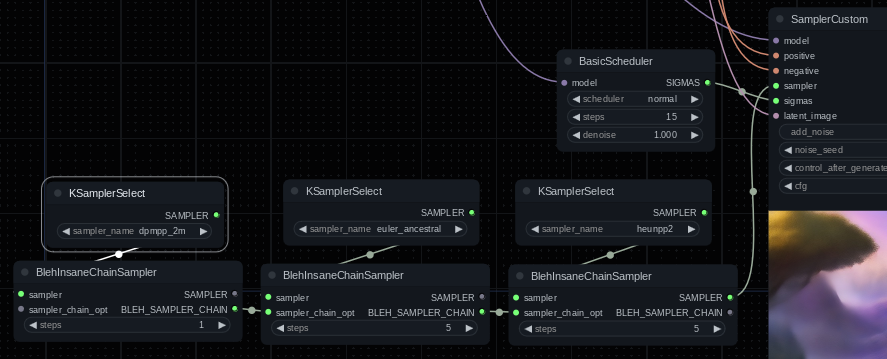

# BLEH

A ComfyUI nodes collection... eventually.

## Features

1. Better TAESD previews (see below)
2. Allow setting seed, timestep range and step interval for HyperTile (look for the [`BlehHyperTile`](#blehhypertile) node)
3. Allow applying Kohya Deep Shrink to multiple blocks, also allow gradually fading out the downscale factor (look for the [`BlehDeepShrink`](#blehdeepshrink) node)
4. Allow discarding penultimate sigma (look for the `BlehDiscardPenultimateSigma` node). This can be useful if you find certain samplers are ruining your image by spewing a bunch of noise into it at the very end (usually only an issue with `dpm2 a` or SDE samplers).
5. Allow more conveniently switching between samplers during sampling (look for the [BlehInsaneChainSampler](#blehinsanechainsampler) node).
6. Apply arbitrary model patches at an interval and/or for a percentage of sampling (look for the [BlehModelPatchConditional](#blehmodelpatchconditional) node).
7. Ensure a seed is set even when `add_noise` is turned off in a sampler. Yes, that's right: if you don't have `add_noise` enabled _no_ seed gets set for samplers like `euler_a` and it's not possible to reproduce generations. (look for the [BlehForceSeedSampler](#blehforceseedsampler) node).

## Configuration

Copy either `blehconfig.yaml.example` or `blehconfig.json.example` to `blehconfig.yaml` or `blehconfig.json` respectively and edit the copy. When loading configuration, the YAML file will be prioritized if it exists and Python has YAML support.

Restart ComfyUI to apply any new changes.

### Better TAESD previews

* Supports setting max preview size (ComfyUI default is hardcoded to 512 max).
* Supports showing previews for more than the first latent in the batch.
* Supports throttling previews. Do you really need your expensive TAESD preview to get updated 3 times a second?

Current defaults:

|Key|Default|Description|
|-|-|-|
|`enabled`|`true`|Toggles whether enhanced TAESD previews are enabled|
|`max_size`|`768`|Max width or height for previews. Note this does not affect TAESD decoding, just the preview image|
|`max_batch`|`4`|Max number of latents in a batch to preview|
|`max_batch_cols`|`2`|Max number of columns to use when previewing batches|
|`throttle_secs`|`2`|Max frequency to decode the latents for previewing. `0.25` would be every quarter second, `2` would be once every two seconds|
|`maxed_batch_step_mode`|`false`|When `false`, you will see the first `max_batch` previews, when `true` you will see previews spread across the batch|
|`preview_device`|`null`|`null` (use the default device) or a string with a PyTorch device name like `"cpu"`, `"cuda:0"`, etc. Can be used to run TAESD previews on CPU or other available devices.|
|`skip_upscale_layers`|`0`|The TAESD model has three upscale layers, each doubles the size of the result. Skipping some of them will significantly speed up TAESD previews at the cost of smaller preview image results.|

These defaults are conservative. I would recommend setting `throttle_secs` to something relatively high (like 5-10) especially if you are generating batches at high resolution.

Slightly more detailed explanation for `maxed_batch_step_mode`: If max previews is set to `3` and the batch size is `15` you will see previews for indexes `0, 5, 10`. Or to put it a different way, it steps through the batch by `batch_size / max_previews` rounded up. This behavior may be useful for previewing generations with a high batch count like when using AnimateDiff.

More detailed explanation for skipping upscale layers: Latents (the thing you're running the TAESD preview on) are 8 times smaller than the image you get decoding by normal VAE or TAESD. The TAESD decoder has three upscale layers, each doubling the size: `1 * 2 * 2 * 2 = 8`. So for example if normal decoding would get you a `1280x1280` image, skipping one TAESD upscale layer will get you a `640x640` result, skipping two will get you `320x320` and so on. I did some testing running TAESD decode on CPU for a `1280x1280` image: the base speed is about `1.95` sec base, `1.15` sec with one upscale layer skipped, `0.44` sec with two upscale layers skipped and `0.16` sec with all three upscale layers popped (of course you only get a `160x160` preview at that point). The upshot is if you are using TAESD to preview large images or batches or you want to run TAESD on CPU (normally pretty slow) you would probably benefit from setting `skip_upscale_layers` to `1` or `2`. Also if your max preview size is `768` and you are decoding a `1280x1280` image, it's just going to get scaled down to `768x768` anyway.

### BlehModelPatchConditional

**Note**: Very experimental.

This node takes a `default` model and a `matched` model. When the interval or start/end percentage match, the `matched` model will apply, otherwise the `default` one will. This can be used to apply something like HyperTile, Self Attention Guidance or other arbitrary model patches conditionally.

The first sampling step that matches the timestep range always applies `matched`, after that the following behavior applies: If the interval is positive then you just get `matched` every `interval` steps. It is also possible to set interval to a negative value, for example `-3` would mean out of every three steps, the first two use `matched` and the third doesn't.

_Notes and limitations_: Not all types of model modifications/patches can be intercepted with a node like this. You also almost certainly can't use this to mix different models: both inputs should be instances of the same loaded model. It's also probably a bad idea to apply further patches on top of the `BlehModelPatchConditional` node output: it should most likely be the last thing before a sampler or something that actually uses the model.

### BlehHyperTile

Adds the ability to set a seed and timestep range that HyperTile gets applied for. *Not* well tested, and I just assumed the Inspire version works which may or may not be the case.

It is also possible to set an interval for HyperTile steps, this time it is just normal sampling steps that match the timestep range. The first sampling step that matches the timestep range always applies HyperTile, after that the following behavior applies: If the interval is positive then you just get HyperTile every `interval` steps. It is also possible to set interval to a negative value, for example `-3` would mean out of every three steps, the first two have HyperTile and the third doesn't.

**Note**: Timesteps start from 999 and count down to 0 and also are not necessarily linear. Figuring out exactly which sampling step a timestep applies
to is left as an exercise for you, dear node user. As an example, Karras and exponential samplers essentially rush to low timesteps and spend quite a bit of time there.

HyperTile credits:

The node was originally taken by Comfy from taken from: https://github.com/tfernd/HyperTile/

Then the Inspire node pack took it from the base ComfyUI node: https://github.com/ltdrdata/ComfyUI-Inspire-Pack

Then I took it from the Inspire node pack. The original license was MIT so I assume yoinking it into this repo is probably okay.

### BlehDeepShrink

AKA `PatchModelAddDownScale` AKA Kohya Deep Shrink. Compared to the built-in Deep Shrink node this version has the following differences:

1. Instead of choosing a block to apply the downscale effect to, you can enter a comma-separated list of blocks. This may or not actually be useful but it seems like you can get interesting effects applying it to multiple blocks. Try `2,3` or `1,2,3`.
2. Adds a `start_fadeout_percent` input. When this is less than `end_percent` the downscale will be scaled to end at `end_percent`. For example, if `downscale_factor=2.0`, `start_percent=0.0`, `end_percent=0.5` and `start_fadeout_percent=0.0` then at 25% you could expect `downscale_factor` to be around `1.5`. This is because we are deep shrinking between 0 and 50% and we are halfway through the effect range. (`downscale_factor=1.0` would of course be a no-op and values below 1 don't seem to work.)
3. Expands the options for upscale and downscale types, you can also turn on antialiasing for `bicubic` and `bilinear` modes.

*Notes*: It seems like when shrinking multiple blocks, blocks downstream are also affected. So if you do x2 downscaling on 3 blocks, you are going to be applying `x2 * 3` downscaling to the lowest block (and maybe downstream ones?). I am not 100% sure how it works, but the takeway is you want to reduce the downscale amount when you are downscaling multiple blocks. For example, using blocks `2,3,4` and a downscale factor of `2.0` or `2.5` generating at 3072x3072 seems to work pretty well. Another note is schedulers that move at a steady pace seem to produce better results when fading out the deep shrink effect. In other words, exponential or Karras schedulers don't work well (and may produce complete nonsense). `ddim_uniform` and `sgm_uniform` seem to work pretty well and `normal` appears to be decent.

Deep Shrink credits:

Adapted from the ComfyUI source which I presume was adapted from the version Kohya initially published.

### BlehInsaneChainSampler

A picture is worth a thousand words, so:

This will use `heunpp2` for the first five steps, `euler_ancestral` for the next five, and `dpmpp_2m` for however many remain.

This is basically the same as chaining a bunch of samplers together and manually setting the start/end steps.

**Note**: Even though the `dpmpp_2m` insane chain sampler node has `steps=1` it will run for five steps. This is because the requirement of fifteen total steps must be fulfilled and... you can't really sample stuff without a sampler. Also note progress might be a little weird splitting sampling up like this.

### BlehForceSeedSampler

Currently, the way ComfyUI's advanced and custom samplers work is if you turn off `add_noise` _no_ global RNG seed gets set. Samplers like `euler_a` use this (SDE samplers use a different RNG method and aren't subject to this issue). Anyway, the upshot is you will get a different generation every time regardless of what the seed is set to. This node simply wraps another sampler and ensures that the seed gets set.
